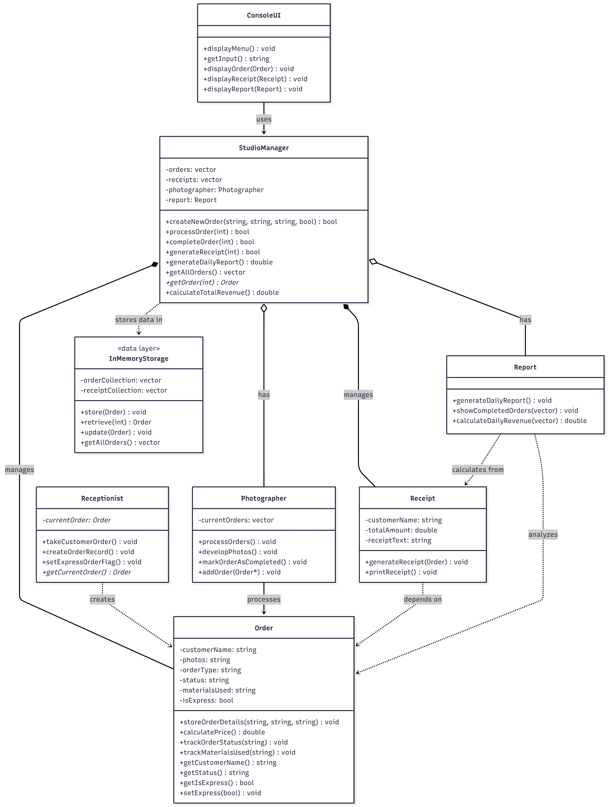
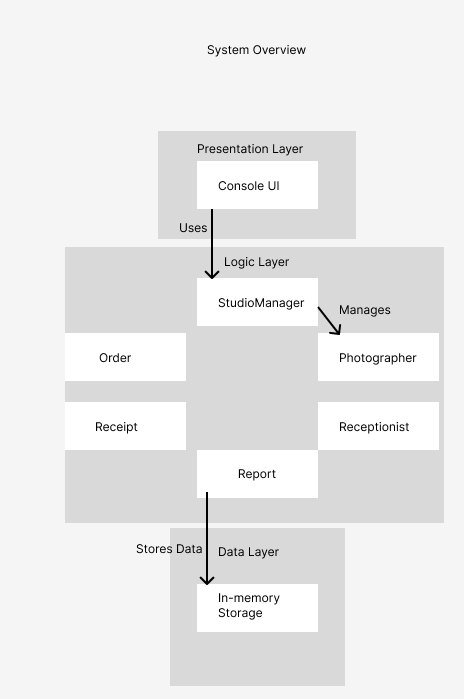
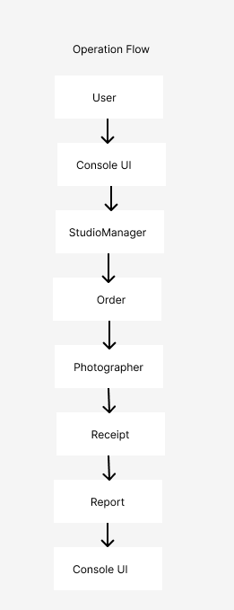

# Release 2 - Detailed Level Design

## Overview
This Detailed Level Design document describes the structure developed for the second release of our project. The system automates invoice generation, price customization depending on the urgency. The system generates forms for both the client and photographer. Additionally, the system tracks consumables usage.

## System Overview

### Architecture - Three-Tier Design

**Presentation Layer (UI):**
* `ConsoleUI` - Main user interface for forms and input
  * Menu-driven interface
  * Handles user input and displays output
  * Delegates all business logic to StudioManager

**Logic Layer (Business):**
* `StudioManager` - Main business logic coordinator
  * `Order` - Stores order details, calculates prices
  * `Photographer` - Manages photo processing workflow
  * `Receipt` - Generates formatted receipts
  * `Report` - Generates daily reports and revenue calculations
  * `Receptionist` - Manages order intake process

**Data Layer (Storage):**
* In-memory storage for Release 2 (vectors in StudioManager)
* No direct database access

### Design Principles
* UI never accesses repositories directly
* Data layer never prints to console
* Business logic layer returns values instead of void
* Proper separation of concerns across all three layers

## 3. UML Class Diagram

### System Architecture Diagram

The following UML class diagram illustrates the complete system architecture, showing all classes, their relationships, and the three-tier architecture:



### Class Relationships

**StudioManager (Coordinator)**
- Owns collection of `Order` objects (1..*)
- Owns collection of `Receipt` objects (1..*)
- Has one `Photographer` instance
- Has one `Report` instance
- Acts as the central coordinator for all business operations

**Order (Entity)**
- Uses `OrderStatus` enum for type-safe status management
- Contains pricing constants (`BASE_PRICE`, `EXPRESS_MULTIPLIER`)
- Independent entity that can exist without other classes

**Receipt (Entity)**
- Depends on `Order` for generation
- Created by StudioManager
- Immutable once generated

**Photographer (Workflow Manager)**
- Maintains references to `Order*` objects in processing queue
- Does not own orders, just manages references

**Report (Analytics)**
- Stateless service class
- Operates on collections passed to it
- No internal state or dependencies

**ConsoleUI (Presentation)**
- Depends on `StudioManager` only
- Never directly accesses entities or data
- Follows strict layering principle

### Implementation Screenshots

The following screenshots show the implemented system in action:

#### Screenshot 1: Order Creation and Management



#### Screenshot 2: Receipt Generation and Reports



## Class Details

### StudioManager
**Purpose:** Coordinates all business operations and manages data storage

**Key Methods:**
* `createNewOrder()` - Creates and stores new orders
* `processOrder()` - Assigns orders to photographer
* `completeOrder()` - Marks orders as completed
* `generateReceipt()` - Creates receipts for orders
* `generateDailyReport()` - Generates revenue reports
* `getAllOrders()` - Returns all orders
* `calculateTotalRevenue()` - Calculates total revenue

### ConsoleUI
**Purpose:** Handles all user interaction

**Features:**
* Interactive menu system
* Input validation
* Display formatting
* Error handling

### Order
**Purpose:** Stores order information and calculates prices

**Features:**
* Customer details
* Order type and status tracking
* Express order flag (25% price increase)
* Material usage tracking

### Photographer
**Purpose:** Manages photo processing workflow

**Features:**
* Maintains queue of current orders
* Processes pending orders
* Marks orders as completed
* Returns operation counts

### Receipt
**Purpose:** Generates formatted receipts

**Features:**
* Professional receipt formatting
* Price calculation
* Customer information display
* Express order indication

### Report
**Purpose:** Generates business reports

**Features:**
* Daily report generation
* Completed orders listing
* Revenue calculation

## Workflow

1. User creates order through ConsoleUI
2. StudioManager stores order and creates Order object
3. Order can be processed (assigned to Photographer)
4. Photographer updates order status
5. Order can be completed
6. Receipt can be generated for completed orders
7. Daily report shows all completed orders and revenue

## 4. Class Descriptions

| Class | Type | Purpose | Attributes | Methods |
|-------|------|---------|------------|---------|
| **StudioManager** | Business Logic Coordinator | Orchestrates all business operations and manages in-memory data storage | `orders: vector<Order>`, `receipts: vector<Receipt>`, `photographer: Photographer`, `report: Report` | `createNewOrder()`, `processOrder()`, `completeOrder()`, `generateReceipt()`, `generateDailyReport()`, `getAllOrders()`, `getOrder()`, `calculateTotalRevenue()` |
| **Order** | Entity | Stores order information, manages status, calculates pricing | `customerName: string`, `photos: string`, `orderType: string`, `status: OrderStatus`, `materialsUsed: string`, `isExpress: bool`, `BASE_PRICE: const double`, `EXPRESS_MULTIPLIER: const double` | `storeOrderDetails()`, `calculatePrice()`, `trackOrderStatus()`, `trackMaterialsUsed()`, `getCustomerName()`, `getStatus()`, `getStatusString()`, `getIsExpress()`, `setExpress()` |
| **Photographer** | Business Entity | Manages photo processing workflow and order queue | `currentOrders: vector<Order*>` | `processOrders()`, `developPhotos()`, `markOrderAsCompleted()`, `addOrder()`, `getCurrentOrders()`, `getOrderCount()` |
| **Receipt** | Entity | Generates and formats receipts | `customerName: string`, `totalAmount: double`, `receiptText: string` | `generateReceipt()`, `getReceiptText()`, `getTotalAmount()`, `getCustomerName()` |
| **Report** | Business Entity | Generates business reports and analytics | None (stateless) | `generateDailyReport()`, `showCompletedOrders()`, `calculateDailyRevenue()` |
| **Receptionist** | Business Entity | Manages order intake process | `currentOrder: Order*` | `createOrderRecord()`, `setExpressOrderFlag()`, `getCurrentOrder()`, `clearCurrentOrder()` |
| **ConsoleUI** | Presentation Layer | Handles all user interaction and display | `studioManager: StudioManager&` | `run()`, `displayMenu()`, `handleCreateOrder()`, `handleProcessOrder()`, `handleCompleteOrder()`, `handleGenerateReceipt()`, `handleViewAllOrders()`, `handleGenerateDailyReport()`, `clearScreen()`, `pauseScreen()` |
| **OrderStatus** | Enum | Type-safe order status values | N/A (enum values: `PENDING`, `PROCESSING`, `IN_PROGRESS`, `COMPLETED`) | N/A |

### Class Responsibilities (Single Responsibility Principle)

- **StudioManager**: Coordinates business operations only
- **Order**: Manages individual order data and pricing only
- **Photographer**: Manages photo processing workflow only
- **Receipt**: Handles receipt generation only
- **Report**: Handles business reporting only
- **Receptionist**: Manages order intake only
- **ConsoleUI**: Handles user interaction only

## 5. Interfaces and Abstractions

### Current Interfaces (Release 2)

Currently, the system does not use explicit interfaces but relies on concrete classes. This design choice is appropriate for Release 2's scope and in-memory storage requirements.

### Planned Interfaces (Release 3+)

The following abstractions are identified for future releases:

| Interface | Purpose | Key Methods | Planned Release |
|-----------|---------|-------------|-----------------|
| **IOrderRepository** | Abstract data persistence for orders | `save()`, `findById()`, `findAll()`, `update()`, `delete()` | Release 3 |
| **IReceiptRepository** | Abstract data persistence for receipts | `save()`, `findByCustomer()`, `findByDateRange()` | Release 3 |
| **IPricingStrategy** | Abstract pricing calculation | `calculatePrice(Order)` | Release 3 |
| **IReportGenerator** | Abstract report generation | `generateReport()`, `exportToFormat()` | Release 3 |
| **INotificationService** | Abstract notification system | `sendNotification()`, `notifyCustomer()` | Release 4 |

### Encapsulation

**Achieved through:**
1. **Private attributes** - All data members are private
2. **Public getters/setters** - Controlled access to data
3. **Enum class** - OrderStatus uses `enum class` for strong typing
4. **Const correctness** - Read-only methods marked `const`
5. **Const data members** - Pricing constants are `constexpr`

**Examples:**
```cpp
// Order class - data is private, accessed via methods
private:
    std::string customerName;
    OrderStatus status;
    static constexpr double BASE_PRICE = 50.0;

// Strong typing with enum class
enum class OrderStatus { PENDING, PROCESSING, IN_PROGRESS, COMPLETED };

// Const correctness
OrderStatus getStatus() const;
double calculatePrice() const;
```

### SOLID Principles

#### **S - Single Responsibility Principle** ✅
Each class has one clear responsibility:
- `Order` - manages order data only
- `Receipt` - generates receipts only
- `Report` - generates reports only
- `ConsoleUI` - handles UI only
- `StudioManager` - coordinates operations only

#### **O - Open/Closed Principle** ✅
Classes are open for extension but closed for modification:
- Pricing uses constants that can be extended to strategies (Release 3)
- OrderStatus enum can be extended with new states
- Report generation can be extended without modifying existing code

#### **L - Liskov Substitution Principle** ⚠️
Not fully applicable in Release 2 (no inheritance hierarchy). Will be relevant in Release 3 with repository interfaces.

#### **I - Interface Segregation Principle** ✅
Classes expose only necessary methods:
- `Order` has specific getters, not a generic `getData()`
- `Report` has focused methods: `generateDailyReport()`, `showCompletedOrders()`, `calculateDailyRevenue()`
- Clients use only the methods they need

#### **D - Dependency Inversion Principle** ⚠️
Partially achieved:
- **Release 2**: ConsoleUI depends on concrete StudioManager (acceptable for this release)
- **Release 3**: Will introduce repository interfaces for true dependency inversion
- **Current**: High-level modules don't depend on low-level modules (UI doesn't access data storage)

## 6. Methods and Functions

### StudioManager Methods

#### `bool createNewOrder(customerName, photos, orderType, isExpress)`
**Purpose:** Creates a new order and adds it to the system  
**Input:** 
- `customerName: string` - Customer's name
- `photos: string` - Description of photos
- `orderType: string` - Type of photography service
- `isExpress: bool` - Whether order is express

**Output:** `bool` - true if order created successfully  
**Validation (Release 3):**
- Customer name not empty (min 2, max 100 characters)
- Photos description not empty
- Order type from predefined list
- Express flag validation against business hours

#### `bool processOrder(orderIndex)`
**Purpose:** Assigns order to photographer for processing  
**Input:** `orderIndex: int` - Index of order in collection  
**Output:** `bool` - true if order processed successfully  
**Validation (Release 3):**
- Order index is valid (within bounds)
- Order status is PENDING
- Photographer capacity check
- Materials availability check

#### `bool completeOrder(orderIndex)`
**Purpose:** Marks order as completed  
**Input:** `orderIndex: int` - Index of order in collection  
**Output:** `bool` - true if order completed successfully  
**Validation (Release 3):**
- Order index is valid
- Order status is PROCESSING or IN_PROGRESS
- Quality check completed
- Photos developed and ready

#### `bool generateReceipt(orderIndex)`
**Purpose:** Generates and displays receipt for an order  
**Input:** `orderIndex: int` - Index of order in collection  
**Output:** `bool` - true if receipt generated successfully  
**Validation (Release 3):**
- Order index is valid
- Order status is COMPLETED
- Payment information verified
- Customer information complete

#### `double generateDailyReport()`
**Purpose:** Generates daily business report  
**Input:** None  
**Output:** `double` - Total daily revenue  
**Validation (Release 3):**
- Date range validation
- Business day verification
- Report permissions check

### Order Methods

#### `void storeOrderDetails(customer, photos, type)`
**Purpose:** Initializes order with customer details  
**Input:** Customer name, photos description, order type (all strings)  
**Output:** None (modifies object state)  
**Validation (Release 3):**
- All fields required and non-empty
- Customer name format validation
- Order type enum validation

#### `double calculatePrice() const`
**Purpose:** Calculates order price with express surcharge  
**Input:** None (uses object state)  
**Output:** `double` - Final price  
**Business Logic:**
- Base price: $50.00 (BASE_PRICE constant)
- Express multiplier: 1.25 (25% increase)
- Formula: `BASE_PRICE * (isExpress ? EXPRESS_MULTIPLIER : 1.0)`

**Validation (Release 3):**
- Price within business limits
- Discount code application
- Tax calculation
- Currency conversion

#### `void trackOrderStatus(newStatus)`
**Purpose:** Updates order status  
**Input:** `newStatus: OrderStatus` - New status (enum)  
**Output:** None (modifies object state)  
**Validation (Release 3):**
- Valid status transitions only (state machine)
- Timestamp recording
- Notification triggers
- Audit log entry

#### `string getStatusString() const`
**Purpose:** Converts enum status to human-readable string  
**Input:** None (uses object state)  
**Output:** `string` - Status as text  
**Logic:** Switch statement mapping enum to string

### Photographer Methods

#### `int processOrders()`
**Purpose:** Process all pending orders in queue  
**Input:** None  
**Output:** `int` - Count of orders processed  
**Validation (Release 3):**
- Equipment availability check
- Materials inventory check
- Time slot validation
- Photographer workload limits

#### `int markOrderAsCompleted()`
**Purpose:** Mark in-progress orders as completed  
**Input:** None  
**Output:** `int` - Count of orders completed  
**Validation (Release 3):**
- Quality assurance passed
- All photos developed
- Client review if required
- Packaging ready

### Receipt Methods

#### `void generateReceipt(order)`
**Purpose:** Creates formatted receipt from order  
**Input:** `order: const Order&` - Order object  
**Output:** None (sets receiptText)  
**Format:** Professional receipt with header, customer info, pricing, footer  
**Validation (Release 3):**
- Order completion verified
- Payment status confirmed
- Receipt number generated
- Tax calculations accurate

### Report Methods

#### `void showCompletedOrders(orders)`
**Purpose:** Displays list of completed orders  
**Input:** `orders: const vector<Order>&` - All orders  
**Output:** None (prints to console)  
**Validation (Release 3):**
- Date range filtering
- Customer privacy compliance
- Report access permissions

#### `double calculateDailyRevenue(receipts) const`
**Purpose:** Calculates total revenue from receipts  
**Input:** `receipts: const vector<Receipt>&` - All receipts  
**Output:** `double` - Total revenue  
**Validation (Release 3):**
- Date filtering
- Currency conversion
- Tax separation
- Refund handling

### ConsoleUI Methods

#### `void run()`
**Purpose:** Main application loop  
**Input:** None  
**Output:** None (runs until user exits)  
**Logic:** Display menu → Get input → Execute action → Repeat

#### `void handleCreateOrder()`
**Purpose:** UI workflow for creating new order  
**Input:** User input from console  
**Output:** None (creates order via StudioManager)  
**Validation (Release 3):**
- Input sanitization
- Format validation
- Required field checks
- User confirmation

### Validation Strategy (Release 3)

**Where validation will be added:**

1. **Input Layer (ConsoleUI):**
   - Format validation
   - Required field checks
   - Range validation
   - User-friendly error messages

2. **Business Layer (StudioManager, Entities):**
   - Business rule validation
   - State transition validation
   - Constraint enforcement
   - Domain logic validation

3. **Data Layer (Future Repositories):**
   - Referential integrity
   - Unique constraints
   - Database constraints
   - Transaction validation

**Current State (Release 2):**
- Basic input validation in ConsoleUI
- Bounds checking in StudioManager
- No persistence validation (in-memory only)

## 9. Validation Rules and Future Work

### Release 2 Focus

**Release 2** prioritizes **structure and architecture** over comprehensive validation and error handling. The primary goals are:
- ✅ Establish three-tier architecture
- ✅ Implement core business logic
- ✅ Demonstrate workflow from order creation to receipt generation
- ✅ Apply SOLID principles and design patterns
- ✅ Use constants and enums (no magic values)
- ✅ Ensure proper encapsulation

**Current validation** in Release 2 is minimal and focuses on:
- Basic bounds checking (array indices)
- Simple input validation in ConsoleUI
- Type safety through enums

### Planned Validation Rules (Release 3)

#### Input Validation (ConsoleUI Layer)

| Field | Validation Rule | Error Message |
|-------|----------------|---------------|
| Customer Name | Required, 2-100 characters, letters and spaces only | "Customer name must be 2-100 characters and contain only letters" |
| Customer Name | No leading/trailing spaces | "Customer name cannot start or end with spaces" |
| Photos Description | Required, 10-500 characters | "Photos description must be between 10 and 500 characters" |
| Order Type | Must be from predefined list: Wedding, Portrait, Event, Product, Studio | "Invalid order type. Choose from: Wedding, Portrait, Event, Product, Studio" |
| Order Index | Must be valid integer ≥ 0 | "Please enter a valid order number" |
| Order Index | Must exist in system | "Order not found. Please check the order number" |
| Express Flag | Boolean (y/n) | "Please enter 'y' for yes or 'n' for no" |

#### Business Logic Validation (StudioManager/Entity Layer)

| Operation | Validation Rule | Business Logic |
|-----------|----------------|----------------|
| Create Order | Customer name unique per day | Prevent duplicate orders from same customer |
| Process Order | Order status must be PENDING | Cannot process already processed orders |
| Process Order | Photographer capacity < 10 orders | Workload management |
| Complete Order | Order status must be PROCESSING or IN_PROGRESS | Status transition validation |
| Complete Order | Minimum 24 hours elapsed (non-express) | Business day requirement |
| Complete Order | Minimum 4 hours elapsed (express) | Express service requirement |
| Generate Receipt | Order status must be COMPLETED | Cannot generate receipt for incomplete orders |
| Generate Receipt | No existing receipt for order | Prevent duplicate receipts |
| Calculate Price | Base price > 0 | Sanity check |
| Calculate Price | Final price < $10,000 | Upper limit for fraud prevention |
| Track Materials | Material codes must be valid | Inventory system integration |

#### Data Validation (Repository Layer - Release 3)

| Entity | Validation Rule | Constraint Type |
|--------|----------------|-----------------|
| Order | Customer name NOT NULL | Database constraint |
| Order | Order ID unique | Primary key |
| Order | Created timestamp NOT NULL | Database constraint |
| Receipt | Order ID foreign key exists | Referential integrity |
| Receipt | Total amount > 0 | Check constraint |
| Receipt | Receipt number unique | Unique constraint |

### Exception Handling Strategy (Release 3)

#### Custom Exception Hierarchy

```cpp
// Base exception class
class StudioException : public std::exception {
protected:
    std::string message;
public:
    explicit StudioException(const std::string& msg) : message(msg) {}
    const char* what() const noexcept override { return message.c_str(); }
};

// Specific exception types
class ValidationException : public StudioException {
    // Invalid input data
};

class BusinessRuleException : public StudioException {
    // Business logic violations
};

class OrderNotFoundException : public StudioException {
    // Order not found in system
};

class InvalidStateTransitionException : public StudioException {
    // Invalid order status change
};

class DatabaseException : public StudioException {
    // Database/persistence errors
};

class FileIOException : public StudioException {
    // File read/write errors
};
```

#### Try-Catch Implementation Plan

**Pattern 1: Input Layer (ConsoleUI)**
```cpp
void ConsoleUI::handleCreateOrder() {
    try {
        // Get user input
        // Validate format
        // Call StudioManager
        bool success = studioManager.createNewOrder(...);
        if (success) {
            std::cout << "✓ Order created successfully\n";
        }
    } catch (const ValidationException& e) {
        std::cout << "❌ Validation Error: " << e.what() << "\n";
        // Prompt user to try again
    } catch (const StudioException& e) {
        std::cout << "❌ Error: " << e.what() << "\n";
    } catch (const std::exception& e) {
        std::cout << "❌ Unexpected error occurred\n";
        // Log error for debugging
    }
}
```

**Pattern 2: Business Logic Layer (StudioManager)**
```cpp
bool StudioManager::processOrder(int orderIndex) {
    try {
        // Validate order index
        if (orderIndex < 0 || orderIndex >= orders.size()) {
            throw OrderNotFoundException("Order not found");
        }
        
        Order& order = orders[orderIndex];
        
        // Validate order status
        if (order.getStatus() != OrderStatus::PENDING) {
            throw InvalidStateTransitionException(
                "Order must be in PENDING status to process"
            );
        }
        
        // Check photographer capacity
        if (photographer.getOrderCount() >= MAX_PHOTOGRAPHER_CAPACITY) {
            throw BusinessRuleException(
                "Photographer at maximum capacity"
            );
        }
        
        // Process the order
        photographer.addOrder(&order);
        order.trackOrderStatus(OrderStatus::PROCESSING);
        return true;
        
    } catch (const StudioException&) {
        throw; // Re-throw to calling layer
    } catch (const std::exception& e) {
        throw StudioException("Failed to process order: " + 
                             std::string(e.what()));
    }
}
```

**Pattern 3: Data Layer (Repository - Release 3)**
```cpp
void OrderRepository::save(const Order& order) {
    try {
        // Open database connection
        // Execute INSERT/UPDATE
        // Commit transaction
    } catch (const DatabaseException& e) {
        // Rollback transaction
        throw DatabaseException("Failed to save order: " + 
                               std::string(e.what()));
    }
}
```

### File I/O Implementation (Release 3)

#### Planned File Operations

**1. Order Persistence (JSON Format)**
```cpp
// OrderRepository.cpp
class OrderFileRepository {
public:
    void saveToFile(const std::vector<Order>& orders, 
                   const std::string& filename);
    std::vector<Order> loadFromFile(const std::string& filename);
    
private:
    std::string serializeOrder(const Order& order);
    Order deserializeOrder(const std::string& json);
};

// File format: orders.json
{
    "orders": [
        {
            "id": 1,
            "customerName": "Alice Smith",
            "photos": "Wedding photos",
            "orderType": "Wedding",
            "status": "COMPLETED",
            "isExpress": true,
            "createdAt": "2025-10-28T10:30:00Z",
            "completedAt": "2025-10-28T14:30:00Z"
        }
    ]
}
```

**2. Receipt Export (PDF/Text)**
```cpp
// ReceiptExporter.cpp
class ReceiptExporter {
public:
    void exportToText(const Receipt& receipt, const std::string& filename);
    void exportToPDF(const Receipt& receipt, const std::string& filename);
};
```

**3. Daily Report Export**
```cpp
// ReportExporter.cpp
class ReportExporter {
public:
    void exportDailyReport(const std::vector<Order>& orders,
                          const std::vector<Receipt>& receipts,
                          const std::string& filename);
};
```

**4. Configuration File (Settings)**
```ini
# config.ini
[Pricing]
BasePrice=50.00
ExpressMultiplier=1.25

[Business]
MaxPhotographerCapacity=10
MinProcessingHours=24
ExpressProcessingHours=4

[Database]
ConnectionString=studio.db
AutoSaveInterval=300

[Reports]
ExportDirectory=./reports/
DateFormat=%Y-%m-%d
```

#### Error Handling for File Operations

```cpp
try {
    orderRepository.saveToFile(orders, "orders.json");
} catch (const FileIOException& e) {
    std::cerr << "Failed to save orders: " << e.what() << "\n";
    // Fallback: Try backup location
    try {
        orderRepository.saveToFile(orders, "backup/orders.json");
    } catch (const FileIOException& backup_error) {
        std::cerr << "Backup save failed: " << backup_error.what() << "\n";
        // Notify user data may be lost
    }
}
```

### Planned Diagrams (Release 3)

#### 1. **Class Diagram**
- Show all classes with attributes and methods
- Show relationships (composition, aggregation, inheritance)
- Show interfaces and implementations
- Tool: PlantUML or Draw.io

#### 2. **Sequence Diagrams**

**Create Order Flow:**
```
User → ConsoleUI → StudioManager → Order → Receptionist
```

**Process Order Flow:**
```
User → ConsoleUI → StudioManager → Photographer → Order
```

**Generate Receipt Flow:**
```
User → ConsoleUI → StudioManager → Receipt → Order
```

#### 3. **State Machine Diagram**
```
Order Status Transitions:
PENDING → PROCESSING → IN_PROGRESS → COMPLETED
         ↓
      CANCELLED (future)
```

#### 4. **Activity Diagram**
- Complete order workflow from creation to receipt generation
- Decision points (express vs. standard)
- Error handling paths

#### 5. **Component Diagram**
- Three-tier architecture visualization
- Component dependencies
- Interface boundaries

#### 6. **Deployment Diagram** (Release 4)
- Application deployment structure
- Database server
- File storage
- Client terminals

### Testing Strategy (Release 3)

#### Unit Tests
```cpp
// test_order.cpp
TEST(OrderTest, CalculatePrice_Standard) {
    Order order;
    order.storeOrderDetails("Test", "Photos", "Portrait");
    order.setExpress(false);
    EXPECT_EQ(order.calculatePrice(), 50.0);
}

TEST(OrderTest, CalculatePrice_Express) {
    Order order;
    order.storeOrderDetails("Test", "Photos", "Portrait");
    order.setExpress(true);
    EXPECT_EQ(order.calculatePrice(), 62.5);
}

TEST(OrderTest, StatusTransition_Valid) {
    Order order;
    order.storeOrderDetails("Test", "Photos", "Portrait");
    EXPECT_EQ(order.getStatus(), OrderStatus::PENDING);
    order.trackOrderStatus(OrderStatus::PROCESSING);
    EXPECT_EQ(order.getStatus(), OrderStatus::PROCESSING);
}
```

#### Integration Tests
- Test complete workflows
- Test file I/O operations
- Test error handling paths
- Test database interactions

#### Validation Tests
- Test all validation rules
- Test boundary conditions
- Test invalid inputs
- Test exception handling

### Migration Plan (Release 2 → Release 3)

**Phase 1: Add Validation Layer**
1. Implement ValidationException hierarchy
2. Add validation to all input methods
3. Add try-catch blocks in ConsoleUI
4. Test validation rules

**Phase 2: Add Persistence Layer**
1. Design repository interfaces
2. Implement file-based repositories
3. Add JSON serialization/deserialization
4. Implement auto-save functionality

**Phase 3: Enhanced Error Handling**
1. Implement custom exception classes
2. Add comprehensive try-catch blocks
3. Add error logging
4. Add user-friendly error messages

**Phase 4: Documentation**
1. Create all planned diagrams
2. Update DLD with Release 3 details
3. Create user manual
4. Create API documentation

**Phase 5: Testing**
1. Write unit tests
2. Write integration tests
3. Perform validation testing
4. Perform user acceptance testing

## Implementation Status (Release 2)

✅ **Architecture & Structure**
- Three-tier architecture complete
- SOLID principles applied
- Design patterns implemented
- Proper encapsulation

✅ **Core Functionality**
- Order management working
- Receipt generation working
- Report generation working
- Status tracking working

✅ **Code Quality**
- No linter errors
- Constants and enums used
- Const correctness applied
- Memory management proper

✅ **Documentation**
- DLD complete with validation plans
- Class descriptions documented
- Method specifications documented
- Future work planned

⏳ **Planned for Release 3**
- Comprehensive validation
- Exception handling
- File I/O persistence
- Database integration
- Enhanced error handling
- Unit tests
- Integration tests
- UML diagrams

**Release 2 Status: ✅ COMPLETE and READY FOR TESTING**

---

*Note: Release 2 focuses on establishing a solid architectural foundation and demonstrating core business functionality. Advanced features like comprehensive validation, persistent storage, and extensive error handling are intentionally deferred to Release 3 to maintain clear release boundaries and manageable scope.* 