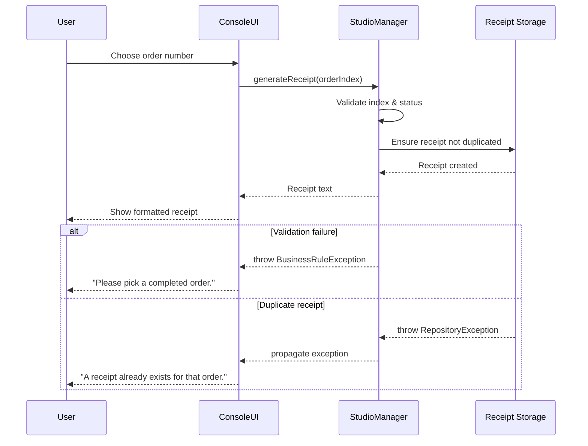

# Release 3 — Behavioral Focus

Release 3 keeps the Release 2 architecture (`ConsoleUI → StudioManager → Repository (vectors)`) and concentrates on one end-to-end logic: **`generateReceipt(orderIndex)`**. The same flow drives validation rules, behavioral diagrams, and the exception policy below.

---

## Section 13 – Validation & Exception Rules

| Class / Method | Preconditions | Postconditions | Validation Level | Explanation |
| --- | --- | --- | --- | --- |
| `ConsoleUI::handleGenerateReceipt()` | User selects an order number, input is numeric and ≥ 0 | Sanitized index forwarded to Logic layer | UI | Prevents invalid keystrokes and keeps error messages friendly before calling business logic |
| `StudioManager::generateReceipt()` | Order index within range, order status is `COMPLETED`, no receipt already stored for that index | Receipt is created, stored in repository vector, and text returned to UI | Logic | Consolidates business rules and ensures the same guard clauses protect every caller |
| `Receipt::generateReceipt()` | Receives non-negative `orderIndex`, order has a calculable price | Receipt text is formatted, `orderId` persisted for deduplication | Repository | Keeps data consistent and signals storage problems (duplicate ids) before the UI displays results |

Every precondition above appears as a decision node in the Activity diagram and as a guard in the Sequence diagram. Each postcondition maps to a green (success) end node.

---

## Section 14 – Behavioral UML Models

### Activity Diagram – Generate Receipt Flow

```mermaid
flowchart TD
    A([User selects "Generate Receipt"]) --> B{UI input valid?}
    B -- No --> B1[Show friendly validation message<br/>Ask for another number]
    B -- Yes --> C{Order index in range?}
    C -- No --> C1[Logic throws BusinessRuleException<br/>UI reports issue]
    C -- Yes --> D{Order status is COMPLETED?}
    D -- No --> D1[Logic rejects request<br/>UI tells user to finish order]
    D -- Yes --> E{Receipt already exists?}
    E -- Yes --> E1[Repository signals duplicate<br/>UI informs user]
    E -- No --> F[Create receipt text<br/>Store in receipts vector]
    F --> G([UI displays receipt to user])
```

### Sequence Diagram – Generate Receipt Flow



---

## Section 15 – Error & Exception Policy

| Exception Type | Thrown By (Layer/Class) | Caught At (Layer) | User Message | Default Action |
| --- | --- | --- | --- | --- |
| `InputValidationException` | UI — `ConsoleUI::promptOrderIndex()` | UI | “Please enter a number from the list.” | Show message → retry input |
| `BusinessRuleException` (invalid index or status) | Logic — `StudioManager::generateReceipt()` | UI | “That order is not ready for a receipt yet.” | Show message → stop current action |
| `RepositoryException` (duplicate receipt / invalid id) | Repository — `Receipt::generateReceipt()` or duplicate check | UI | “A receipt already exists for the selected order.” | Show message → stop current action |

All exceptions bubble back to the UI, which owns the only `try/catch` blocks and translates errors into non-technical language.

---

## Section 16 – Revision History

| Version | Date | Description |
| --- | --- | --- |
| 1.0 | 2025-09-23 | Release 1 contains boilerplate code and initial planning. |
| 2.0 | 2025-10-28 | Release 2 provides most functional code. |
| 3.0 | 2025-11-21 | Added Release 3 validation table, behavioral diagrams for `generateReceipt`, updated exception policy, and synchronized code with the documented guards. |

